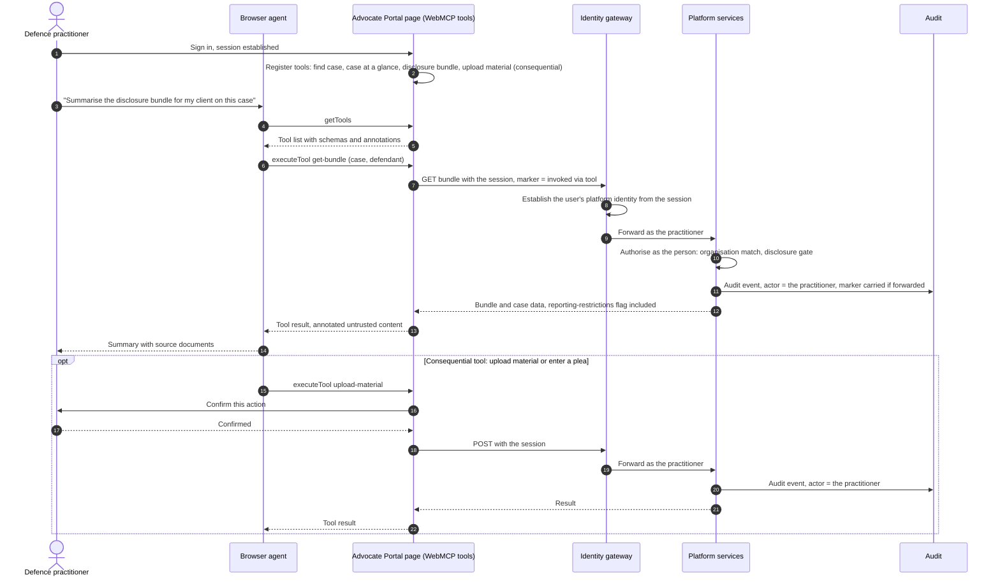

# Should defence interact with the Common Platform over MCP?

**For:** the Chief Product Officer and the design authority.
**Prompted by:** "Why wouldn't we let defence interact over MCP?", after reading a vendor post,
*6 reasons to implement WebMCP* (nekuda, 5 September 2026).
**Evidence:** the CP knowledge store, an internal corpus of 168 Common Platform repositories,
read on 2026-09-07; the [WebMCP specification](https://webmachinelearning.github.io/webmcp/)
(Draft Community Group Report, 4 September 2026); the
[MCP authorisation specification](https://modelcontextprotocol.io/specification/draft/basic/authorization);
the API Marketplace's internal authentication standards. Legal points are named for counsel
to confirm, not asserted.

**This is a public document.** The detailed evidence behind each measured claim, with file
paths, counts and commands, is held in the CP knowledge store's internal finding of the same
date. Where this document says *internal evidence*, that is where it is.

---

## The answer in one page

**Defence already interacts with the Common Platform.** The Advocate Portal lets a defence
lawyer find a case, declare representation, read the case and the initial disclosure bundle,
download and upload material, enter pleas and grant access to colleagues. So the question is not
whether defence should have access. It is whether an **AI agent acting for a defence
practitioner** should have machine access to the same things, and on what terms.

**Two different technologies are being run together.** The post is about **WebMCP**: a browser
feature, a draft in a W3C community group, that lets a web page expose its buttons and forms as
tools to an agent running in the user's own browser, inside their own logged-in session. "Let
defence interact over MCP" means the other thing: a **remote MCP server** that an agent connects
to from outside, with its own credentials, over the platform's APIs. The first is a change to the
Advocate Portal's front end. The second is a new external channel into the court record. They
carry very different risk and should be decided separately.

**It is technically possible, and the MCP server is not a build.** The estate has the parts: an
API gateway with OAuth 2.0 and rate limits, a set of published external API specifications, and
scoped defence queries already engineered behind the portal. Azure API Management, which the API
Marketplace (AMP) runs on, exposes the operations of an API it already manages as a remote MCP
server with no code, and its policies apply to the tool calls. MCP itself is a thin layer over
APIs.

**Three things were measured as missing. The API Marketplace's own standards close one at
application level and leave two open.**

1. **An identity for "this agent is acting for this named solicitor".** Measured, internal
   evidence: the platform's external APIs carry no user identity, and no delegation flow exists
   anywhere on the estate. **The API Marketplace does not close this.** Its authentication
   standard defines one pattern, application-to-API using OAuth 2.0 client credentials with a
   signed JWT, in which the marketplace trusts the registered application and end-user identity
   is out of scope, to be revisited when a confirmed use case for individual user access
   emerges. What it does give is organisation-level scoping: the gateway mints a token for the
   platform carrying an organisation identifier used for data access. An agent could therefore
   act as the firm, which matches how the Advocate Portal scopes case access by organisation.
   It cannot act as the named person. A defence agent is the confirmed use case the standard
   says should reopen the question.
2. **An audit trail that can prove which human an automated caller acted for.** Measured,
   internal evidence: recording is uneven across the platform's services. **Closed at
   application level by the marketplace gateway**, which logs the calling application, time,
   endpoint and outcome on every request. Not closed at the level of the person, for the reason
   in point 1.
3. **A data-classification scheme enforced somewhere.** The estate's classification vocabulary
   for victim, witness, address and health data exists in governance documents and review
   tooling, not in any running service. **Still open.** Nothing in the marketplace or the
   gateway filters fields unless a policy is written per API.

**Recommendation.** Do not answer "why not" with a channel. Answer it with a scoped experiment,
gated on the two prerequisites still open: a user-identity pattern in the marketplace, and
classification enforced in a running service. Read-only first, on data already published
externally, with the human named in every call once that is possible. WebMCP on the Advocate
Portal is a separate, cheaper question with its own governance point. Write actions over MCP,
such as pleas and uploads, wait for the delegation model. Details and decisions are at the end.

---

## 1. What is being proposed, precisely

| | WebMCP | MCP (remote server) |
|---|---|---|
| Owner and status | W3C Web Machine Learning Community Group; "Draft Community Group Report, 4 September 2026". Not a standard | Anthropic-originated open protocol; specification published with an authorisation section |
| Where the agent runs | In the user's browser. The specification: agents "inherit user identity and authentication context from the browser" and carry "the user's logged-in credentials and session state" | Anywhere; connects to the platform from outside |
| How it identifies | It is the user. Actions are the user's actions | OAuth 2.1 bearer tokens issued to an agent client, with user consent for the client |
| Its own description of the relationship | "Web pages that use WebMCP can be thought of as Model Context Protocol servers that implement tools in client-side script instead of on the backend" | — |
| What the platform must build | Tool declarations in the Advocate Portal's front end | An MCP server (or an API Management configuration), an authorisation server able to issue user-bound tokens to third-party clients, scopes, audit, abuse controls |
| What the platform can see | Only what it sees today, plus a signal that a tool was called | A distinct client identity per agent product, if registration is controlled |

The post gives six reasons to adopt WebMCP: agents move faster, you know when an agent is using
your site, you can see what agents are doing, you can understand user intent, agents complete
tasks better, and Google is starting to measure agent readiness. It says nothing about
authentication, authorisation, audit or data protection, and is written for commercial websites.
The sixth reason has no bearing on a court system. The other five are claims about convenience,
not about lawful, accountable access to the criminal court record.

---

## 2. What defence can do today

| Action | How it works today |
|---|---|
| Find a case | Match on case reference, defendant name, date of birth and hearing date |
| Declare representation | Self-association, recording firm, funding type and Legal Aid flag on the hearing |
| Read case material and the initial disclosure bundle | Case at a Glance; the bundle appears only once an instruction date is recorded |
| Upload material | Filed under a named section and flagged for the prosecution |
| Enter pleas | Plea and allocation commands on the defence service |
| Grant and revoke access | To colleagues, other firms and clerks; revocation cascades |
| Legal Aid override | A representation order locks the association and transfers access automatically |

Every one of these runs through internal endpoints behind the platform's identity gateway.
None is published externally. The nearest external surface is the API marketplace, where at
least one published specification already names defence solicitors as an intended consumer of
case details, and already carries a reporting-restrictions flag.

Two engineering facts recorded in the internal evidence bear on any new channel: the rule that
keeps a firm inside its own defendant's data is enforced surface by surface rather than once,
and not every surface applies it. Those are tolerable behind a portal used by people at human
speed. An agent would find and exercise the exceptions at machine speed.

---

## 3. The challenge, lens by lens

### Legal and professional conduct

An agent that enters a plea, uploads material or grants access to another firm is performing an
act of legal representation. Who is accountable for it: the solicitor, the firm, the agent
vendor, or the court for admitting it? The estate's own controls assume a person: the disclosure
bundle is gated on a lawyer recording an instruction date, and Legal Aid representation orders
override self-service. Reporting restrictions are a flag in the data that a human is trusted to
honour. An agent that summarises, forwards or republishes restricted material is a contempt risk
the platform would have enabled. **For counsel:** professional conduct rules on delegation to
automated tools, and the court's position on machine-originated filings.

### Data protection and classification

At least one published results API states its lawful basis in the contract: public task under
UK GDPR, the administration of justice under the Data Protection Act, and special-category
conditions for health and biometric data. An MCP channel sends that data into a third-party
model provider's context window. That makes the provider a processor, or a controller, and it
needs a DPIA and a lawful basis of its own. The estate's classification scheme, which places
victim and witness identity, defendant address and health data at OFFICIAL-SENSITIVE, lives in
governance documents and review tooling. No running service labels or filters on it. Anything
exposed over MCP would be exposed unlabelled.

### Identity and delegation

This is the central gap. MCP's authorisation model is OAuth 2.1: the agent is an OAuth client,
the MCP server is a resource server, and a user consents to the client at an authorisation
server. The API Marketplace's pattern is OAuth 2.0 client credentials with a signed JWT: a
machine identity with no user in it, by design. Internally, the platform carries a user identity
through its own gateway, and machine callers for partner systems use a per-partner service
identity. There is no on-behalf-of flow, no act-as, no impersonation control. An agent acting
for a named solicitor has no identity shape to occupy. The MCP specification also says plainly
that fine-grained authorisation is not its concern, and its dynamic client registration, now
deprecated but still permitted, would let any agent product register itself unless the platform
restricts registration to vetted clients.

### Security

Prompt injection is the attack the estate has already written down, in its own developer
tooling: tool responses can carry text that hijacks the agent. The WebMCP specification's own
security section names the same family: prompt injection through tool metadata poisoning and
through tool output, misrepresentation of a tool's intent, and privacy leakage through tools
that accept more parameters than they need. Its mitigations are annotations, marking tool
responses "untrusted" and significant actions "consequential", and it places responsibility
across site authors, agent providers, browsers and users rather than prescribing controls. On a
court platform the tool responses are case material, much of it uploaded by other parties. A
malicious or careless document becomes an instruction to the defence agent, and no annotation on
the platform's side can stop the agent's provider from ignoring it. The internal evidence also
records that gateway abuse controls on the external APIs are uneven and were sized for people
and integrations, not for agents that retry.

### Audit and non-repudiation

A court has to be able to say who did what. The internal evidence records that the platform's
audit recording is uneven across service generations, that the actor recorded is asserted at
the gateway rather than verified downstream, and that purpose-of-access is captured per action
in exactly one place, a driver-record lookup that requires a reason and the searching user on
every row. That is the standard an agent channel needs. The marketplace gateway's per-request
log closes this at the level of the application.

### Equality and access to justice

Agents will not arrive evenly. Large firms will have them first; small firms and sole
practitioners on legal aid rates may not; unrepresented defendants will not. A channel that
speeds up some defence teams changes the equality of arms in a way the court did not choose.
The counter-argument is real too: if agents cut the administrative load of case preparation,
the smallest practices gain most. Neither claim has evidence yet. Service Standard point 1,
understand users and their needs, has not been done for this question.

### Reciprocity and neutrality

If defence may act through agents, so may prosecution, and so will the police and probation
integrations that already run at machine speed. The court sits between them. A channel designed
for one party has to be designed for all, or the platform is taking a side.

### Operational

The Advocate Portal already "supports" agents in the way every website does: an agent driving a
browser through the page. WebMCP would make that explicit and cheaper for the agent, and
nothing changes server-side. The marketplace's consumer onboarding runs discover, sandbox,
production, with a data-sharing agreement and DPIA as the production gate.

### Product and strategy

The DSIT Blueprint expects every new central-government service to expose an open API, and the
Technology Code of Practice asks for open standards. Both favour the API work already under way
in the marketplace. Neither says to add an agent protocol before the APIs and their governance
exist. MCP is a wrapper. The value, and the risk, is in what it wraps.

---

## 4. What it would take

| Option | What it is | What the platform must add | Verdict |
|---|---|---|---|
| **A. WebMCP on the Advocate Portal** | Declare the portal's existing actions as tools to a browser agent in the user's session | Front-end tool declarations; a governance position on users delegating to agents inside their own login | Cheap to try, and the fastest way to let an agent act as the signed-in practitioner without new APIs. The risk is that delegation happens invisibly to the platform: the specification leaves user control to the browser and the agent provider. **Reaches only agents inside the browser that support the API**: Gemini in Chrome today, under an origin trial; Claude in Chrome not yet; agents outside the browser not at all. See the note at the end of section 5 |
| **B. Read-only remote MCP exposed by AMP** | API Management exposes existing case-details, hearing and schedule operations as MCP tools. No server is built | A marketplace user-identity pattern, which its standard does not yet define; or, as an interim, the agent registered as the firm's application under the existing pattern, acting as the firm; tool names, schemas and descriptions, which the model reads; classification enforced in the gateway policy; per-client rate limits; gateway logging without response bodies; a DPIA; vetted client registration | The right first experiment. As the firm today; as the person only once the marketplace carries users |
| **C. Write actions over MCP** | Pleas, uploads, grants of access | Everything in B, plus a delegation model the professional-conduct rules accept, a human confirmation step on every write, and non-repudiation the court will stand behind | Not now |

The prerequisites are the same for B and C:

1. **Identity: the marketplace must change to carry a person.** Its standard defines one
   pattern, application-to-API, and puts end-user identity out of scope until a confirmed use
   case appears. The change is a user-consent flow at the marketplace identity provider, a
   minted token that carries the user alongside the organisation identifier, a mapping from that
   user to their own platform identity at the gateway, and the separate DPIA the standard
   already says user-claim tokens need. Until then an agent acts as the firm.
2. **Audit: confirmed at application level.** The gateway logs the application, time, endpoint
   and outcome on every request. Per-person attribution follows from item 1. The driver-record
   lookup, which also records purpose of access, is the standard to compare against.
3. **Classification enforced in a running service**, so OFFICIAL-SENSITIVE fields never enter
   a generic response. Open.
4. **An AI assurance position**: the store holds no AI policy, AI assurance document or AI
   decision record for the platform. The one AI capability in production serves legal advisers
   and judges a fixed set of questions, with groundedness scored but no acceptance threshold.
   Defence-facing agents need a written position before a pilot, not after.
5. **The governance route**: this is an architecturally significant change to an external
   boundary and belongs in front of the design authority before any build.

---

## 5. How WebMCP, the Advocate Portal and AMP would interact

An earlier version of this section drew the portal's WebMCP tool handlers calling AMP with a
token bound to the user. The marketplace's own standards show that no such token exists: AMP
issues application tokens only, and the platform receives a minted token carrying the
organisation, not the person. So there are two honest pictures, and the difference between them
is a change AMP has not yet made.

### 5a. WebMCP on the portal as it stands. AMP is not in the path.

The Advocate Portal already talks to platform services through the identity gateway using the
practitioner's session. WebMCP tools would call that same backend. Identity, scoping and audit
are unchanged; the one addition is a marker on tool-invoked calls.



### 5b. Through AMP. Only possible once AMP carries a person.

If the portal's calls are to route through the marketplace gateway, as the marketplace standard
says clients calling platform APIs eventually must, AMP needs a pattern it does not have: a
user-consent flow, a minted token carrying the user alongside the organisation identifier, and
a mapping to the user's own platform identity at the gateway. Without it the gateway sees the
portal as the application and the person is lost before the request reaches the platform.

```mermaid
sequenceDiagram
    autonumber
    actor U as Defence practitioner
    participant A as Browser agent
    participant P as Advocate Portal page (WebMCP tools)
    participant I as Marketplace identity provider
    participant G as AMP gateway (API Management)
    participant S as Platform services
    participant L as Audit

    U->>P: Sign in
    P->>I: User-consent flow (not in the current marketplace standard)
    I-->>P: Token carrying user and application
    A->>P: executeTool get-bundle
    P->>G: GET bundle, Bearer token, marker = invoked via tool
    G->>G: Validate token; mint platform token with organisation AND a user claim (new)
    G->>L: Gateway log: application, endpoint, outcome (today); user (new)
    G->>S: Forward; map user claim to platform identity (new)
    S->>S: Authorise as the person
    S->>L: Audit event, actor = the practitioner
    S-->>P: Response
    P-->>A: Tool result, annotated untrusted content
```

What the two pictures settle:

- **AMP needs updating for either WebMCP path that keeps the person.** Picture 5a avoids the
  need by not using AMP. Picture 5b needs the marketplace to add the three steps marked "new".
  Under AMP as documented, a call from the portal is a call from the portal application.
- **The agent never talks to AMP in either picture.** The platform learns an agent was involved
  only if the page marks tool-invoked calls. That marker is a front-end change and should be
  part of any WebMCP work.
- **Consent for consequential actions lives in the page.** The WebMCP specification leaves the
  confirmation to the browser and the agent provider. The portal should not rely on that.
- **Option B, the remote MCP server, has the same dependency.** Under the current pattern the
  agent product registers as the firm's application and acts as the firm, which AMP can scope
  by organisation today. Acting as the named practitioner needs the same user-identity pattern
  as 5b.

**Which agents can use WebMCP tools, as at 2026-09-08.** The practitioner's choice of agent
decides whether picture 5a gives them anything.

- **Gemini in Chrome: yes.** Chrome carries WebMCP in an origin trial from Chrome 149 to 156,
  with native shipping targeted at Chrome 157, around November 2026. Gemini in Chrome is the
  first-party agent confirmed to support it. A site can register tools now against a polyfill
  so they work through the trial and after.
- **Claude in Chrome: not yet.** It drives pages by screenshots and DOM snapshots and has no way
  to discover or call page-registered tools. An open feature request on the Claude Code
  repository asks for that. Community bridge extensions forward page tools to Claude Code on a
  developer's own machine; they are not something to ask practitioners to install.
- **Agents outside the browser: no.** WebMCP tools run in the page. A desktop or firm-hosted
  agent reaches them only by driving a browser, which is the remote MCP route by another name.

Sources: [Join the WebMCP origin trial](https://developer.chrome.com/blog/ai-webmcp-origin-trial)
(Chrome for Developers); [WebMCP standard now in Chrome origin trials](https://www.infoq.com/news/2026/06/webmcp-web-agent-standard-chrome/)
(InfoQ, June 2026); [WebMCP support in Claude Chrome Extension](https://github.com/anthropics/claude-code/issues/30645)
(open feature request); [Connect WebMCP browser tools to Claude Code](https://mcpcat.io/guides/connect-webmcp-tools-claude-code-bridge-extension/)
(bridge extension guide); [WebMCP Chrome extensions compared](https://webmcp-checker.com/blog/webmcp-browser-extensions-guide-2026).
Read as search summaries on 2026-09-08; confirm on the live pages before citing onward.

---

## 6. Decisions for the CPO

1. **Separate the two questions.** WebMCP on the Advocate Portal is a front-end and policy
   question. A remote MCP channel is a new external boundary. Decide them on different papers.
2. **Reframe "why not" as "for whom, to do what, with what accountability".** Commission a
   short discovery with defence practitioners and the Legal Aid Agency before any technical
   work. The estate has no user research on this need.
3. **Put the user-identity use case to the marketplace team formally.** Their standard invites
   it when a confirmed use case for individual user access emerges. A defence agent is that
   case. Classification enforced at the gateway is the other open item and is owed to the
   existing external integrations already.
4. **If a pilot is wanted, make it option B**: read-only, on data already published externally,
   with a vetted agent client, a DPIA, and a kill criterion set before it starts: any
   unattributed access, or any OFFICIAL-SENSITIVE field in a response, ends it.

---

## 7. What this document cannot tell you

- **The law.** Professional conduct rules, contempt, disclosure duties and data-protection roles
  are named here for counsel to settle. Nothing above is legal advice.
- **Live behaviour.** Every platform fact is a declaration in code or in internal architecture
  notes, not an observation of production.
- **The standards' futures.** WebMCP is a community-group draft; the MCP authorisation section
  is a published specification that still changes. Both were read on 2026-09-07.
- **The whole estate.** 168 repositories of an unknown total.
- **The user need.** No defence practitioner was asked. That is the first thing to fix.
- **The detail.** This is the public version. The measured evidence, with paths, counts and
  commands, is in the CP knowledge store's internal finding of the same date.
